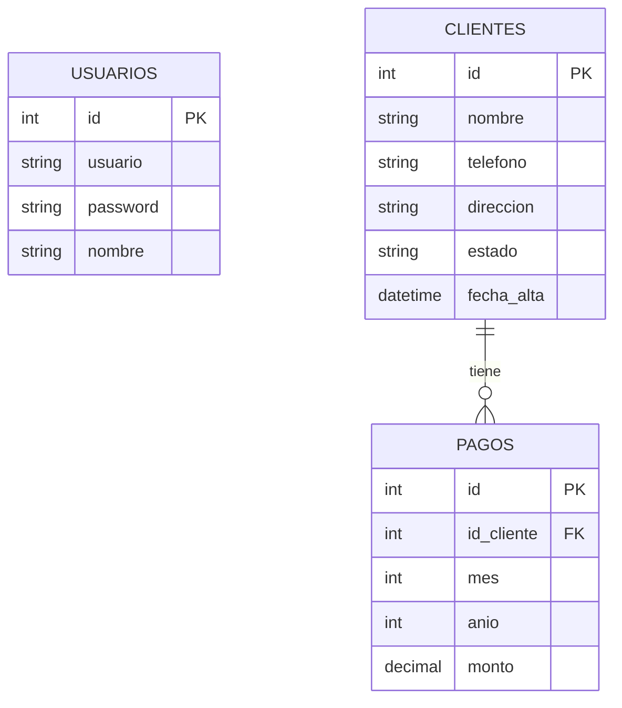
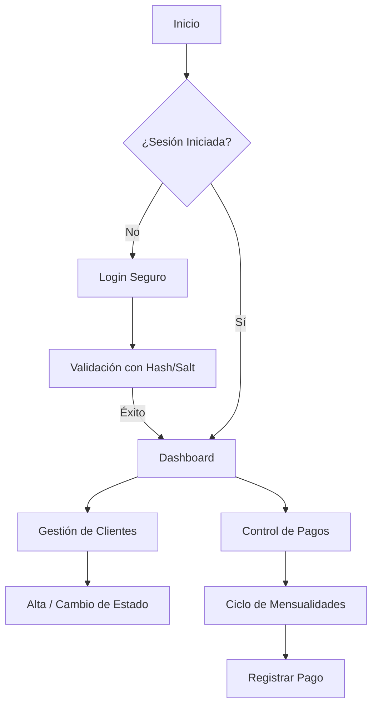

# Documentación del Proyecto: Sistema de Gestión de Redes Inalámbricas

**Estudiante:** Jennifer
**Repositorios de GitHub:**
*   **Tarea 1 (Login):** [https://github.com/JenniferRdz/login](https://github.com/JenniferRdz/login)
*   **Tarea 2 (Sistema Completo):** [https://github.com/JenniferRdz/sistema-redes-actividad2](https://github.com/JenniferRdz/sistema-redes-actividad2)

---

## 1. Descripción General
Aplicación web desarrollada para solucionar el problema de gestión de clientes y control de pagos de un negocio de servicios de internet. El sistema permite la autenticación segura, el registro de clientes con estados visuales y el control de mensualidades mediante una matriz interactiva.

## 2. Diagramas del Sistema

### A. Diagrama de Entidad-Relación (Base de Datos)
El sistema utiliza **3 Entidades** relacionadas en SQL Server:

### B. Diagrama de Flujo de la Aplicación

---

## 3. Estructuras de Programación Utilizadas

### A. Sentencias (`if` / `else`)
*   **Uso:** Validación de credenciales en el login y determinación de colores para los estados de los clientes.
*   **Ejemplo:** Si el cliente está en estado "Baja", la fila se pinta de rojo.

### B. Ciclos (`loops`)
*   **Uso:** Se utilizan ciclos `while` para listar los clientes y ciclos `for` anidados para generar las columnas de los 12 meses del año en la matriz de pagos.

### C. Arreglos (`arrays`)
*   **Uso:** Se emplean arreglos para el mapeo de estilos CSS y para la gestión de los nombres de los meses del año, facilitando el mantenimiento del código.

### D. Base de Datos (3 Entidades)
1.  **Usuarios:** Gestión de acceso administrativo.
2.  **Clientes:** Información de los abonados al servicio.
3.  **Pagos:** Historial de mensualidades pagadas por cliente.

---

## 4. Tecnologías Utilizadas
*   **Backend:** PHP 8.2 con Drivers Microsoft SQLSRV.
*   **Base de Datos:** Microsoft SQL Server Express 2019.
*   **Frontend:** Bootstrap 5, Bootstrap Icons y JavaScript Vanilla.
*   **Seguridad:** Hashing de contraseñas con Bcrypt (Salt automático).
